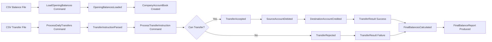

# Domain model

## Purpose

- Implementation is deliberately small and aligned to the code challenge rubric.
- These artefacts make the domain model explicit for reviewers.
- Production concerns are documented, not implemented.
- **Not** event sourcing; no event bus or event store at runtime.
- Artefacts here support review; they are not extra runtime complexity.

## Tactical DDD map

| Domain concept | DDD pattern | Ruby example | Responsibility |
| --- | --- | --- | --- |
| CompanyAccountBook | Aggregate root | `Domain::CompanyAccountBook` | Coordinates transfers; protects invariants |
| Account | Entity | `Domain::Account` | Debit/credit behaviour |
| AccountNumber | Value object | `Domain::AccountNumber` | 16-digit validation |
| Money | Value object | `Domain::Money` | Safe decimal arithmetic |
| TransferId | Value object | `Domain::TransferId` | Business idempotency key (ADR 007) |
| TransferInstruction | Command input | `Domain::TransferInstruction` | From, to, amount, transfer_id |
| TransferResult | Domain result | `Domain::TransferResult` | Success / failure / skipped |
| IdempotencyRegistry | Application port | `Application::InMemoryIdempotencyRegistry` | Prevents double apply |
| TransferJournal | Application port | `Application::InMemoryTransferJournal` | Auditable outcome log |
| CSV readers | Infrastructure | `CsvAccountBalanceReader`, `CsvTransferInstructionReader` | Parse files → domain objects |
| ProcessDay | Application service | `Application::ProcessDay` | Orchestrates use cases |
| ConsoleReporter | Infrastructure | `Infrastructure::ConsoleReporter` | Format output |

Equivalent types exist in `dotnet/` and `nodejs-typescript/` with the same names.

## Aggregate root

**Why `CompanyAccountBook` is the aggregate root**

- A transfer affects **two** accounts; insufficient funds and missing accounts must be decided before any mutation.
- `Account` owns debit/credit mechanics but not cross-account consistency.
- Failed transfers call `evaluate` first; `apply` never runs on failure, so no partial mutation.

**Why `Account` is not the aggregate root for transfers**

- Transfer invariants span source and destination; a single account cannot enforce both sides.

## Key invariants

| Invariant | Enforcement |
| --- | --- |
| Account numbers must be valid (16 digits) | `AccountNumber` |
| Money amounts must be valid (non-negative, ≤2 dp) | `Money` |
| Transfer amount must be positive | `TransferInstruction` |
| Source account must exist | `CompanyAccountBook#evaluate` |
| Destination account must exist | `CompanyAccountBook#evaluate` |
| Source cannot go below zero | `Account#can_debit?` / `:insufficient_funds` |
| Failed transfers must not partially mutate balances | `evaluate` before `apply`; tested |
| Final balances must be deterministic | Sorted by account number; golden fixture specs |

## Command flow

| Command | Intent | Implementation | Result |
| --- | --- | --- | --- |
| LoadOpeningBalances | Build account book from CSV | `LoadAccountBalances#call` | `CompanyAccountBook` |
| ProcessDailyTransfers | Run full processing day | `ProcessDay#call` | `ProcessingReport` |
| ProcessTransferInstruction | Apply one instruction | `ProcessTransfers#process` | `TransferResult` |
| ProduceFinalBalanceReport | Print summary and balances | `ConsoleReporter#report` | String output |

## Event storming

For understanding only; **not** event sourcing at runtime.

### Commands

| Command | Intent | Implementation |
| --- | --- | --- |
| LoadOpeningBalances | Create account book from balance file | `LoadAccountBalances` |
| ProcessDailyTransfers | Process all transfer rows | `ProcessDay` |
| ProcessTransferInstruction | Apply or simulate one transfer | `CompanyAccountBook#transfer` / `#simulate` |
| ProduceFinalBalanceReport | Display results | `ConsoleReporter` |

### Domain events (conceptual)

| Event | Meaning | Mapping |
| --- | --- | --- |
| OpeningBalancesLoaded | Balances read from CSV | `LoadAccountBalances#call` |
| TransferInstructionParsed | Row → instruction | `CsvTransferInstructionReader` |
| TransferAccepted / TransferRejected | Outcome | `TransferResult` |
| FinalBalancesCalculated | Book state after batch | `CompanyAccountBook#final_balances` |

### Policies

- When opening balances are loaded, create the account book.
- When a transfer instruction is valid, attempt the transfer.
- When the source has insufficient funds, reject without mutation.
- When an account is missing, reject without mutation.
- When all transfers are processed, report final balances.

## Event storming diagram

## Context boundary

One bounded context: **Transfer Processing**. Appropriate for the scope.

Production could split into File Ingestion, Transfer Processing, Ledger, Audit, and Reporting; not implemented here.

## Production evolution

See [production-roadmap.md](../architecture/production-roadmap.md) and [decisions/](../decisions/README.md).

Persistence, durable idempotency, audit trail, concurrency control, reconciliation, observability, and security are **documented only**; deliberately not implemented in the challenge.
